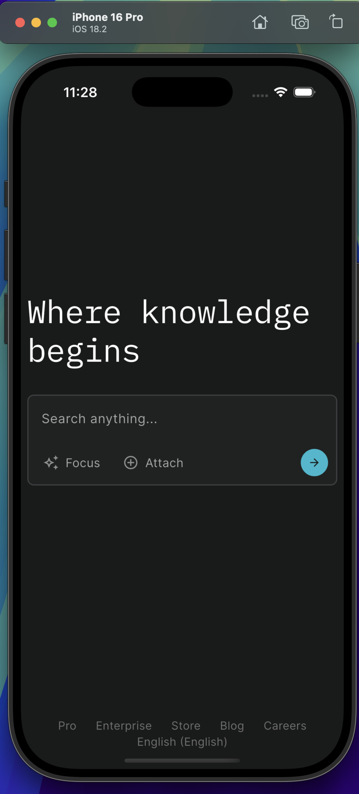
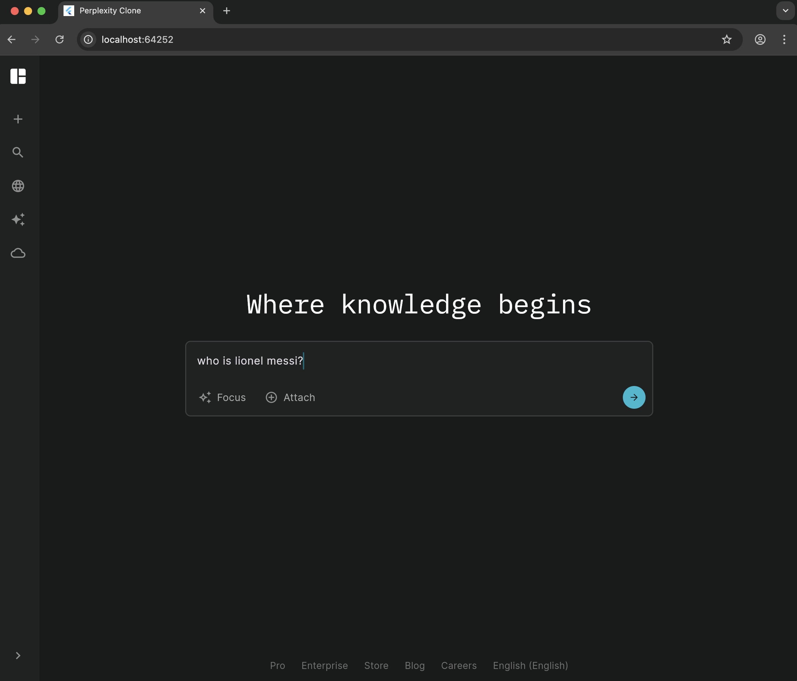
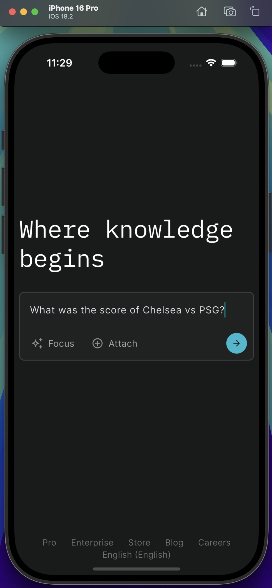
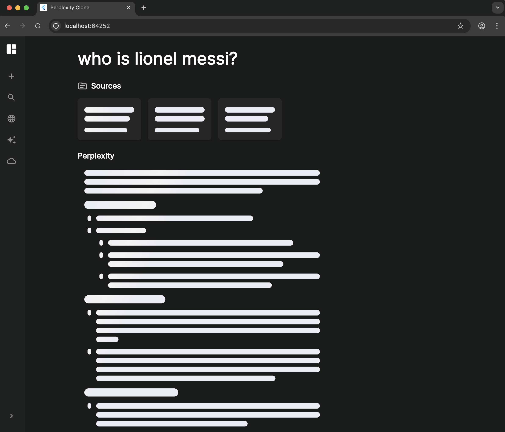
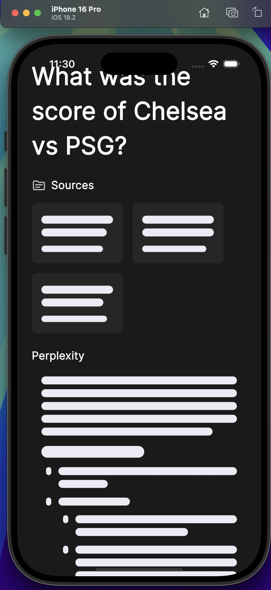
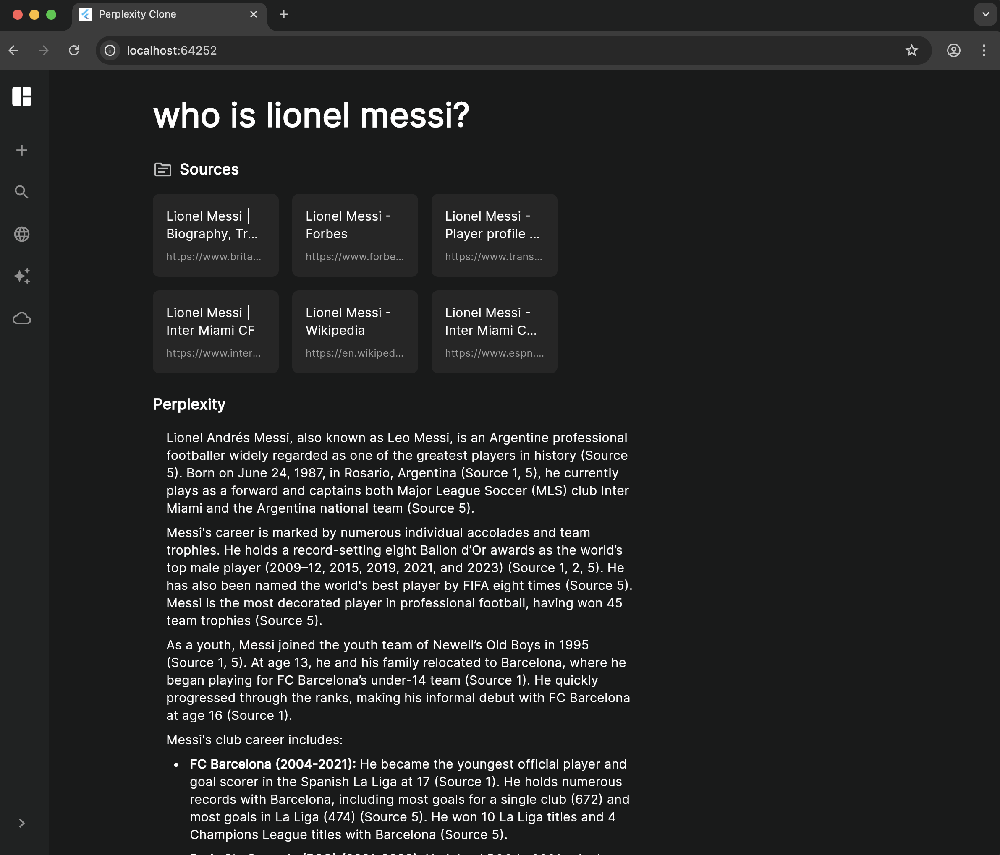
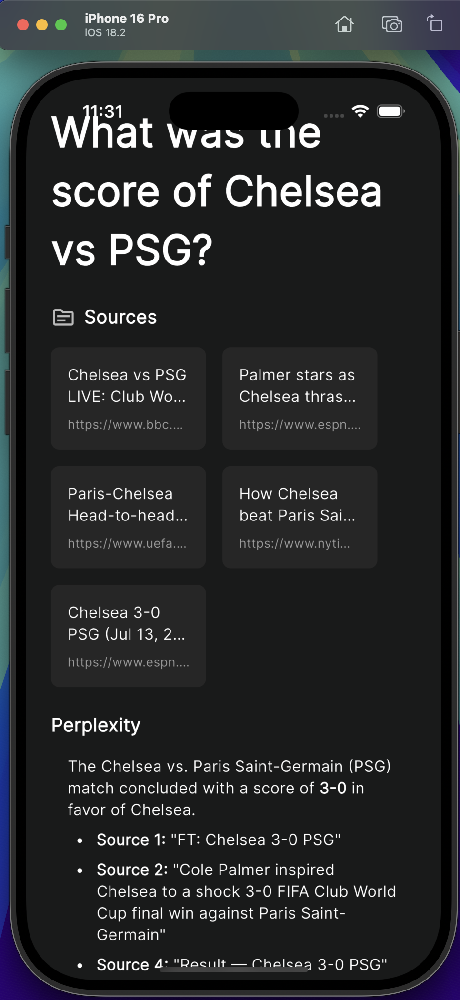

# Perplexity Clone

A modern search interface inspired by Perplexity AI, built with Flutter and FastAPI.

## Tech Stack:
- **Frontend:** Flutter (Web)
- **Backend:** FastAPI with Python
- **AI:** Google Gemini API
- **Search:** Tavily API

## Features:
- Real-time search with AI-powered responses
- Clean, responsive web interface
- Source citations and references
- WebSocket-based streaming responses

## Screenshots:

### Empty Home Screen
<div align="center">
  
  
</div>
<div align="center">
  <em>Web (Chrome) &nbsp;&nbsp;&nbsp;&nbsp;&nbsp;&nbsp;&nbsp;&nbsp;&nbsp;&nbsp;&nbsp;&nbsp;&nbsp;&nbsp;&nbsp;&nbsp;&nbsp;&nbsp;&nbsp;&nbsp;&nbsp;&nbsp;&nbsp;&nbsp;&nbsp;&nbsp;&nbsp;&nbsp;&nbsp;&nbsp; iOS (iPhone 16 Pro)</em>
</div>

### Home Screen with Query
<div align="center">
  
  
</div>

### Loading Answer
<div align="center">
  
  
</div>

### Answer Screen
<div align="center">
  
  
</div>

## Dependencies:

### Frontend (Flutter):
- flutter/material
- flutter/foundation
- http
- web_socket_channel
- skeletonizer
- flutter_markdown

### Backend (Python):
- fastapi
- uvicorn
- python-dotenv
- pydantic
- pydantic-settings
- google-generativeai
- tavily-python
- trafilatura
- sentence-transformers
- numpy

## Setup:

### 1. Clone the repository
```bash
git clone <your-repo-url>
cd perplexity_clone
```

### 2. Set up environment variables
Create a `.env` file in the `server` directory:
```env
TAVILY_API_KEY=your_tavily_api_key_here
GEMINI_API_KEY=your_google_gemini_api_key_here
```

### 3. Install Frontend Dependencies
```bash
flutter pub get
```

### 4. Install Backend Dependencies
```bash
cd server
pip install fastapi uvicorn python-dotenv pydantic-settings google-generativeai tavily-python trafilatura sentence-transformers numpy
```

### 5. Run the Application

#### Start the Backend Server:
```bash
cd server
uvicorn main:app --reload --port 8000
```

#### Start the Flutter Web App:
```bash
flutter run -d chrome
```
